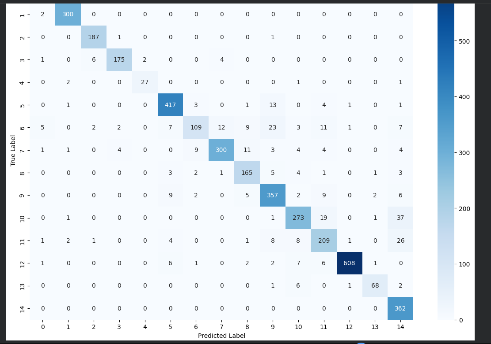
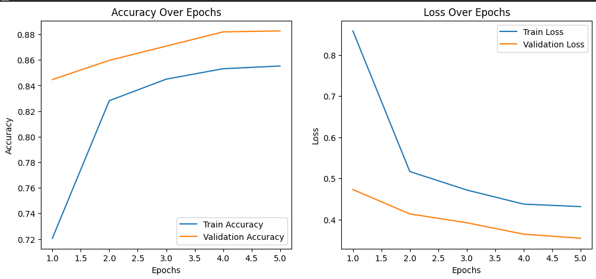

# 🌾 SmartCropAI – Week 3 Final Submission (100%)

## 📘 Summary: Model Evaluation, Fine-Tuning & Final Results
Week 3 focused on **fine-tuning MobileNetV2**, performing **full evaluation**, generating **performance reports**, and conducting **manual testing** on unseen images.  
The model has now achieved strong generalization and is ready for deployment phase.

---

## 🎯 Key Achievements
| Task | Status |
|------|--------|
| Unfroze last 30 layers & fine-tuned | ✅ |
| Evaluated model on validation dataset | ✅ |
| Generated Accuracy & Loss plots | 📈 |
| Created Confusion Matrix & Classification Report | 🧠 |
| Manual image upload prediction testing | 🖼 |
| Final model saved in `.keras` format | 📦 |

---

## 📊 Final Model Performance
| Metric | Value |
|--------|--------|
| **Best Validation Accuracy** | **90.72%** |
| **Final Validation Loss** | **0.2802** |
| **Classes Trained** | 15 |
| **Dataset** | PlantVillage |

---

## 🖼 Evaluation Outputs
### 🔹 Confusion Matrix

### 🔹 Training Graphs (Accuracy & Loss)

---

## 💽 Final Deliverables
| File | Description |
|------|------------|
| `SmartCropAI_Final.ipynb` | Clean end-to-end notebook with removed bulky outputs |
| `SmartCropAI_FinalModel.keras` | Saved trained model |
| `SmartCropAI_ConfusionMatrix.png` | Class-wise performance heatmap |
| `SmartCropAI_TrainingGraphs.png` | Accuracy & Loss visualization |

---

## 📍 Current Status
> **Project Completion: 100% — Ready for deployment phase**
> Final model, outputs, notebook & documentation completed under the AI Internship Project.

